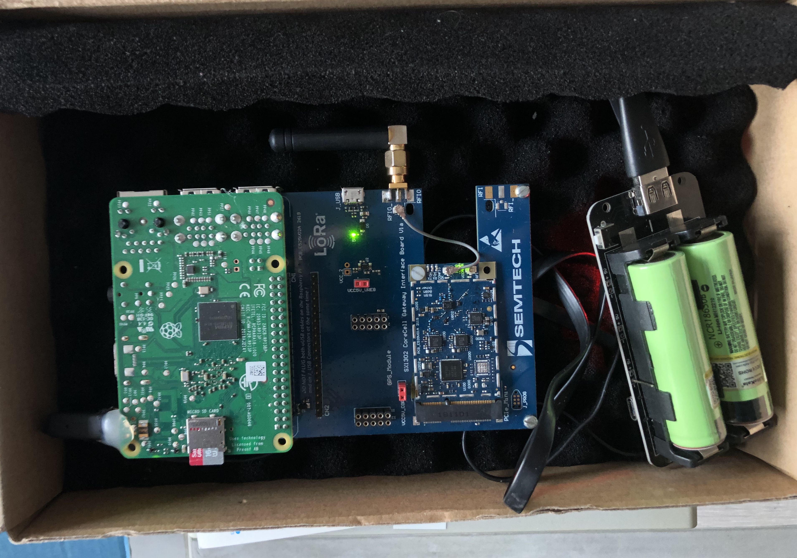

# LoRa Repeater

LoRa repeater for Linux-based LoRa gateways using Semtech UDP forwarder and NodeRED

## Usage
* [High-altitude repeater for emergency trackers (helium balloons)](https://gricad-gitlab.univ-grenoble-alpes.fr/thingsat/public/-/tree/master/balloons/2021-04-15)
* LoRaWAN repeater for white zones

## Install

### Install Semtech UDP packet forwarder

#### RPI + Corecell 
```bash
git clone https://github.com/Lora-net/sx1302_hal
cd ~/sx1302_hal
make
cat ~/sx1302_hal/tools/systemd/readme.md
sudo cp lora_pkt_fwd.service /etc/systemd/system
sudo systemctl daemon-reload
sudo systemctl enable lora_pkt_fwd.service
sudo cp lora_pkt_fwd.conf /etc/rsyslog.d
sudo systemctl restart rsyslog
sudo reboot
```

See the logs
```console
sudo journalctl -u lora_pkt_fwd -f
```
or
```console
cat /var/log/lora_pkt_fwd.log
```

#### RPI + Picocell 
TODO
```console
git clone https://github.com/Lora-net/picoGW_hal
cd ~/picoGW_hal
make
cd ~
git clone https://github.com/Lora-net/picoGW_packet_forwarder
cd ~/picoGW_packet_forwarder
make
```

#### Multitech Conduit MTCDT and MTCAP
* Enables Semtech Packet Forwarder and NodeRED.
* Configurer the packet forwarder with `localhost` as `server` and `1700` for `ports`
* Open the NodeRED web UI and add the repeater flow `flows.js`

### Install Node-RED

Install NodeJS and Node-RED
```bash
mkdir nodered
bash <(curl -sL https://raw.githubusercontent.com/node-red/linux-installers/master/deb/update-nodejs-and-nodered)
```

Install extra modules
```bash
cd ~/.node-red
npm install lora-packet
./node_modules/lora-packet/out/cli.js --hex 40F17DBE4900020001954378762B11FF0D
```

Install Flows
```bash
git clone git@github.com:CampusIoT/lora-repeater.git
cd lora-repeater
cp settings.js ~/.node-red/settings.js
cp flows.json ~/.node-red/flows.json
```

Install Node-RED as a service
```bash
sudo systemctl enable nodered.service
node-red-start
sudo reboot
```

## Configure
TODO

## Check
```bash
tail -f /var/log/syslog
tail -f /var/log/lora_pkt_fwd.log
tail -f ~/nodered/packet_forwarder.log
```

## Tested hardware
* [x] Semtech Corecell Eval Kit (SX1302)
* [ ] [RAK Wireless RAK5146](https://store.rakwireless.com/products/wislink-concentrator-module-sx1303-rak5146-lorawan?variant=39667784908998) (SX1303 + ZOE-M8Q GNSS chip)
* [ ] Multitech MTCDT and MTCAP  (SX1301)
* [ ] RPI + Picocell
* [ ] [Wifx LoRix L1](https://github.com/Wifx/lorix-os) Yocto distribution

## Configure
TODO

## Licence
TODO

## Media




